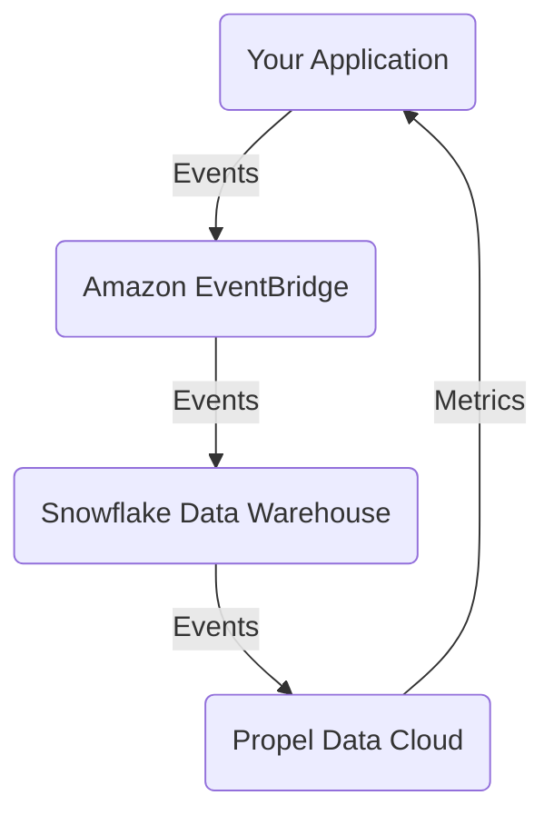
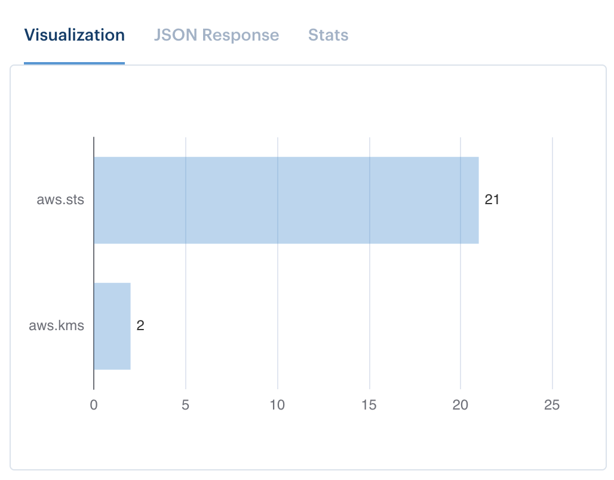

# Event-driven Analytics with Propel

You've heard of [event-driven architecture (EDA)][eda]. How about event-driven
analytics? This project will show you

1. How to pipe events from your [Amazon EventBridge][eventbridge]-backed EDA
   into your [Snowflake][snowflake] data warehouse.
2. How to build metrics on top of your events, suitable for inclusion in product
   dashboards using [Propel][propel].

We'll accomplish all of this following an [infrastructure as code (IaC)][iac]
approach with [Terraform][terraform].



## What you will need…

- **The latest version of Terraform.** See [here][download-terraform] for
  instructions on how to download and setup Terraform.
- **The latest Snowflake Terraform provider.** Follow the installation steps
  [here][terraform-provider-snowflake].
- **The latest Propel Terraform provider.** Follow the installation steps
  [here][terraform-provider-propel].
- **An Amazon Web Services (AWS) Account, an IAM user, and the IAM user's AWS
  access key and secret access key.** If you don't already have an account, you
  can signup for free [here][signup-aws]. Then, follow [this guide][access-key]
  to create an IAM user, access key, and secret access key.
- **A Snowflake account, with database, schema, role, username, password, and
  warehouse already configured.** If you don't already have an account, you can
  signup for free [here][signup-snowflake].
- **A Propel account, with an admin Application, client ID, and client secret.**
  If you don't already have an account, you can join the waitlist
  [here][signup-propel]. Once you have an account, follow
  [this guide][application-guide] to setup your admin Application and get access
  to your client ID and client secret.

## Variables

Once you've completed the pre-requisites above, you'll need to specify Terraform
variables. The easiest way is to copy the `.auto.tfvars.example` file in this
repository and rename it to [`.auto.tfvars`][tfvars-example]. Because
`.auto.tfvars` will contain credentials, it must never be checked into your
repository. In order to prevent this, `.auto.tfvars` has been included in the
[`.gitignore`][gitignore] file.

## Deploying the code…

Once you've setup your variables, run the following `terraform` commands from
the root of the project:

```
terraform init
terraform plan
terraform apply
```

## Testing it…

If you've already got events flowing through EventBridge, you may see events
immediately. Otherwise, you can use the AWS CLI to publish events yourself:

```
aws events put-events --entries '[{"Source":"my-source","DetailType":"my-detail-type","Detail":"{\"foo\":\"bar\"}"}]'
```

Publish a few of these events, wait a few minutes, and navigate to your Metric
in the Propel Console. Using the Metrics Playground, pull up the leaderboard
visualization, and choose the "SOURCE" Dimension to group by. You should now see
a leaderboard of your most common events by "SOURCE".



[eda]: https://en.wikipedia.org/wiki/Event-driven_architecture
[eventbridge]: https://aws.amazon.com/eventbridge/
[snowflake]: https://www.snowflake.com/
[propel]: https://www.propeldata.com/
[iac]: https://en.wikipedia.org/wiki/Infrastructure_as_code
[terraform]: https://www.terraform.io/
[download-terraform]: https://www.terraform.io/downloads
[terraform-provider-snowflake]: https://github.com/Snowflake-Labs/terraform-provider-snowflake#install
[terraform-provider-propel]: https://github.com/propeldata/terraform-provider-propel
[signup-aws]: https://portal.aws.amazon.com/billing/signup
[access-key]: https://aws.amazon.com/premiumsupport/knowledge-center/create-access-key/
[signup-snowflake]: https://signup.snowflake.com/
[signup-propel]: https://www.propeldata.com/
[application-guide]: #
[tfvars-example]: .auto.tfvars.example
[gitignore]: .gitignore
